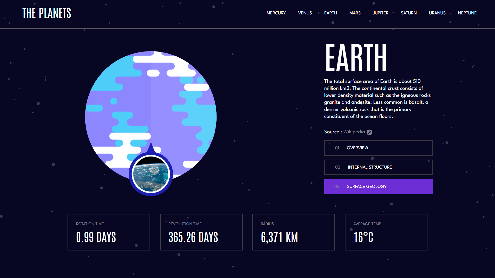
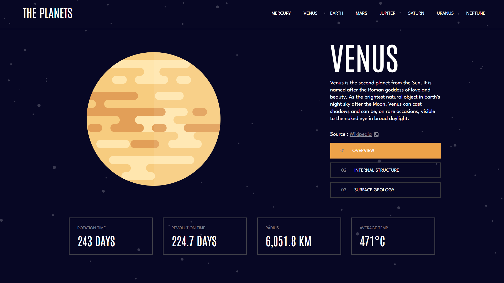
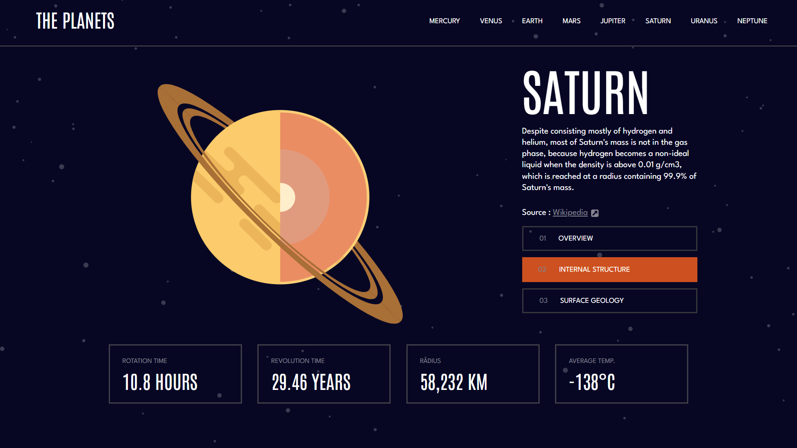
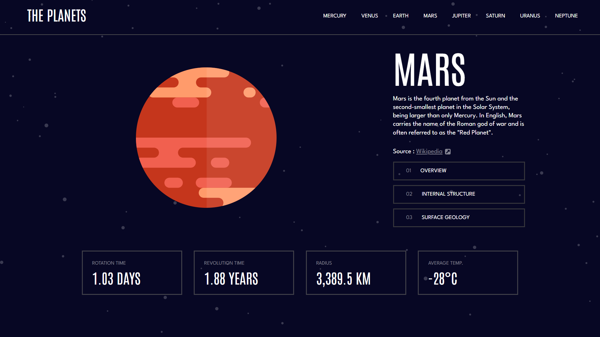

<div align="center">

<h1 align="center"> 🌞 Sistema Solar 🪐 </h1>

Bem-vindo à página do Sistema Solar! Aqui você encontrará informações fascinantes sobre os planetas que compõem o nosso sistema solar.


<h1 align="center"> 🚀 Deploy 🌌</h1>


Para visualizar a página em ação, você pode conferir o deploy do projeto clicando [aqui](https://2024-1s-senai-sp-fe.github.io/sirius-projeto-final/). ou você também pode acessar o projeto diretamente pelo seguinte URL:

[https://2024-1s-senai-sp-fe.github.io/sirius-projeto-final/](https://2024-1s-senai-sp-fe.github.io/sirius-projeto-final/)


<h1 align="center"> 🔭 Visão Geral 🌠</h1>

Estas páginas foram criadas para fornecer uma visão geral do nosso sistema solar. Abaixo estão algumas imagens representativas de alguns planetas do nosso sistema solar:


## 🌍 Terra

   - **Terra**: Nosso planeta, conhecido por sua diversidade de vida e atmosfera que sustenta essa vida.
   
## 🌕 Vênus 

   - **Vênus**: O planeta mais próximo do Sol, com uma atmosfera densa de dióxido de carbono e altas temperaturas superficiais.
   
## 🪐 Saturno

   - **Saturno**: Saturno, o segundo maior planeta do sistema solar, é conhecido por seus deslumbrantes anéis que o cercam e sua atmosfera gasosa marcada por tempestades e nuvens.
   
## 🟠 Marte

   - **Marte**: O "planeta vermelho", com características de superfície que sugerem a presença de água líquida em seu passado e potencial para futuras explorações humanas.

</div>


<h1 align="center"> 📂 Clonando o Repositório 🖥️ </h1>

Se você deseja contribuir ou apenas visualizar o código-fonte, siga estas etapas para clonar o repositório para o seu computador local:

1. Abra o terminal.
2. Navegue até o diretório onde deseja clonar o repositório.
3. Execute o seguinte comando no terminal:

```bash
git clone https://github.com/2024-1S-SENAI-SP-FE/sirius-projeto-final.git
```
Além disso, se preferir, você pode dar um fork do projeto para trabalhar em seu próprio repositório do GitHub.
